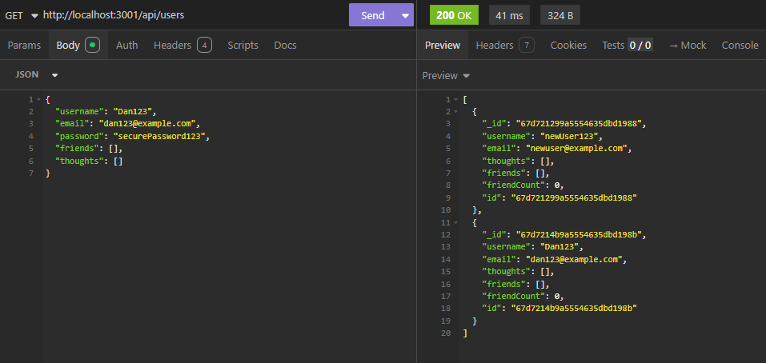
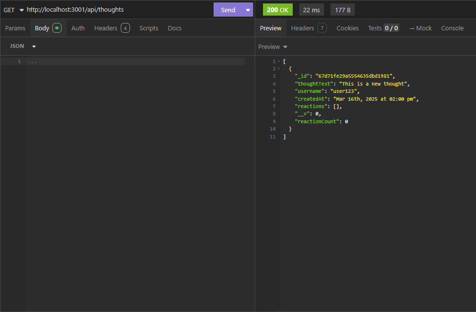

# Challenge-17-Social-Network-API

## Description
This is a Social Network API that utilizes express.js, MongoDB, and Mongoose

## Table of Contents
- [Installation](#installation)
- [Usage](#usage)
- [License](#license)
- [Contributing](#contributing)
- [Tests](#tests)
- [Questions](#questions)

## Installation
Clone the repository & run npm install followed by npm run start to begin the development server. This project connects to MongoDB. Open insomnia and copy / paste the following URL into insomnia: http://localhost:3001/api/thoughts for thoughts, httP://localhost:300/api/users for users, and /reactions for reactions.

## Usage
This is a social media site, where users can create new users, post thoughts, and react to thoughts. Users can also update or delete information. This is done via insomnia. 

Examples calls: 
    Users: 
        GET:    http://localhost:3001/api/users
        POST:
            {
                "username": "",
                "email": "",
                "password": "",
                "friends": [],
                "thoughts": []
            }
        PUT: 
            {
                "username": "",
                "email": ""
            }
        DELETE: http://localhost:3001/api/users/<INSERT USER ID HERE>
    
    Thoughts: 
        GET:    http://localhost:3001/api/thoughts
        POST: 
            {
                "thoughtText": "",
                "username": ""
            }
        PUT: 
            {
                "thoughtText": "",
                "username": ""
            }
        DELETE: http://localhost:3001/api/thoughts/<INSERT THOUGHT ID HERE>

    Reactions: 
          

## License
This project is licensed under the [MIT]([License](https://opensource.org/licenses/MIT)) license.

## Contributing
I am the sole contributor to this project and I utilized the module 17 mini-project to inform my work. If you would like to add to the project please reach out. 

## Tests
Download the necessary packages and ensure that the PUT, GET, POST, and DELETE routes are functioning appropriately in insomnia. 

## Questions
If you have any questions, please contact me at [nataliegindraux@gmail.com](mailto:nataliegindraux@gmail.com) or find me on GitHub [ngin2894](https://github.com/ngin2894).